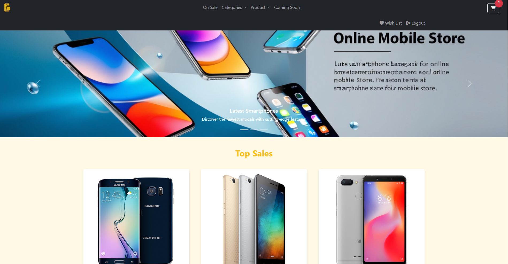
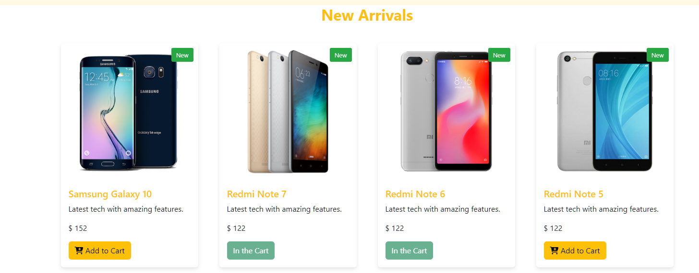
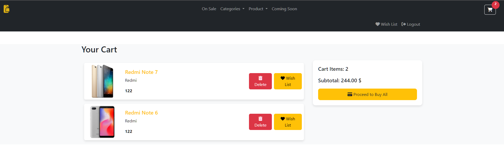
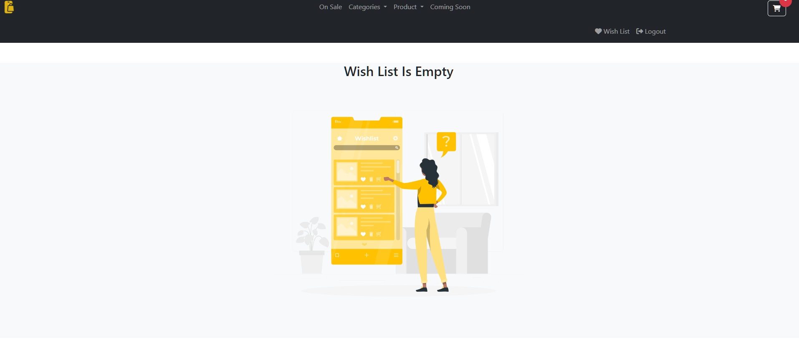
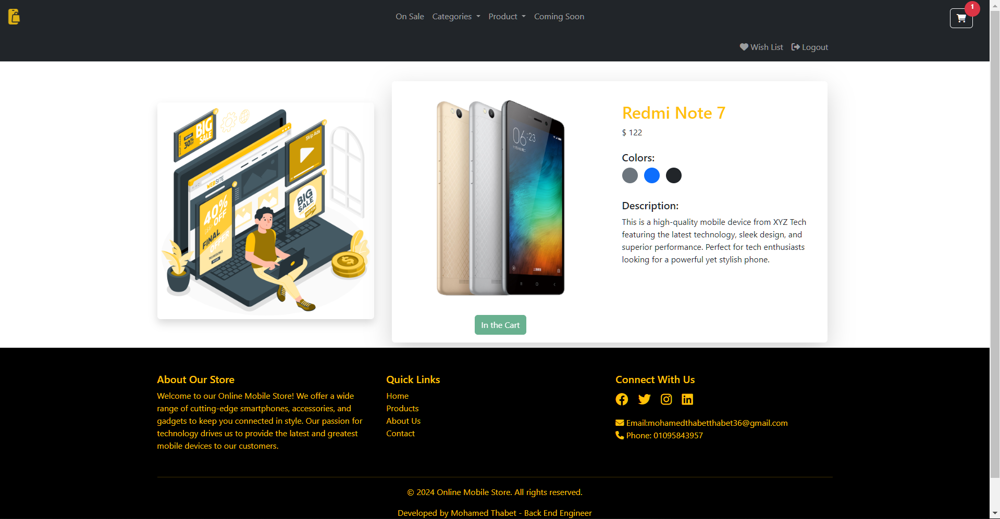
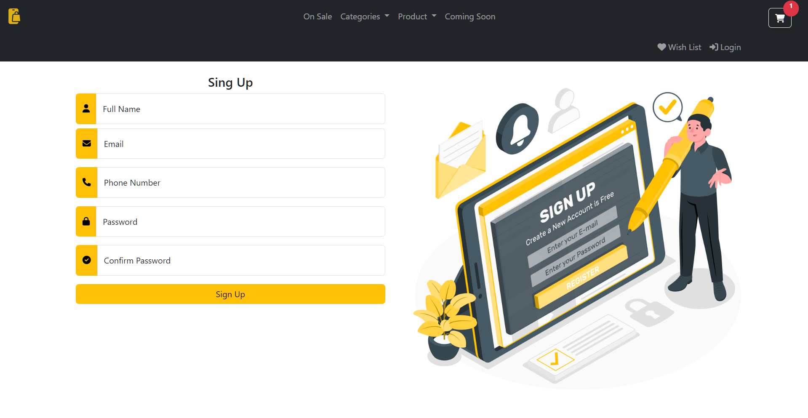
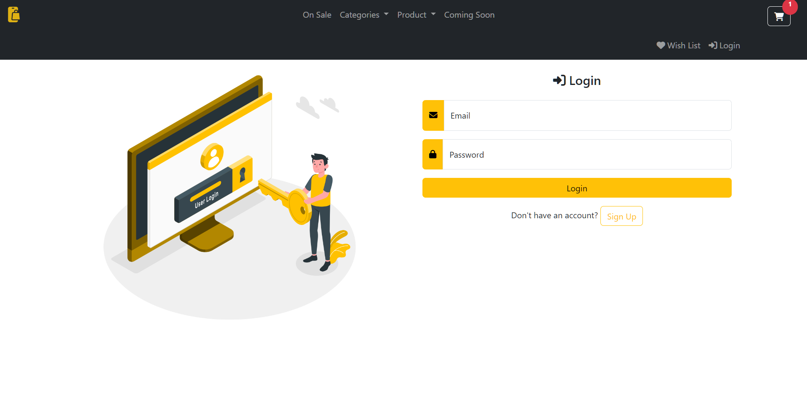

# Mobile Shopee
Mobile Shopee is a simple e-commerce project built with native PHP, focusing on mobile phone sales. This project demonstrates basic e-commerce functionalities and user management systems.
## Features
- **Shopping Cart**
  - Add products to cart
  - Remove products from cart
  - Move products to wishlist
- **Wishlist**
  - Add products to wishlist
  - Remove products from wishlist
  - Move products to cart
- **User Authentication**
  - User registration with validation
  - User login
  - Client-side and server-side form validation
## Technologies Used
### Frontend
- HTML5
- CSS3
- Font Awesome (for icons)
### Backend
- PHP (Native)
- MySQL

## Installation
1. Clone the repository
   ```
   git clone https://github.com/MohamedThabt/Mobile_shopee.git
   ```
2. Set up a local web server (e.g., Apache) and ensure PHP is installed
3. Import the provided SQL file to set up the database
4. Update the database connection details in the configuration file
5. Navigate to the project directory in your web browser
## Usage
1. Register a new account or log in with existing credentials
2. Browse the available mobile phones
3. Add items to your cart or wishlist
4. Proceed to checkout (Note: This is a demo project, no real transactions are processed)
## Contributing
Contributions are welcome! Please feel free to submit a Pull Request.
## Demo







## License
This project is open source and available under the [MIT License](LICENSE).
